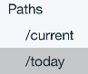

# 1. Best Practices using DataPower with API Connect Developer Toolkit

**Authors** 
* [Tony Ffrench](https://github.com/tonyffrench)
* [Ozair Sheikh](https://github.com/ozairs)

**Duration:** 5 minutes

**Prerequisites**
* [API Connect Developer Toolkit 5.0.7.1](https://www.ibm.com/support/knowledgecenter/SSMNED_5.0.0/com.ibm.apic.toolkit.doc/tapim_cli_install.html)
* Import the API definitions file from **https://github.com/ozairs/apiconnect/blob/master/getting-started/weather-provider-api_1.0.0.yaml**. See instructions [here](https://www.ibm.com/support/knowledgecenter/SSMNED_5.0.0/com.ibm.apic.apionprem.doc/create_api_swagger.html)

In this tutorial, you will learn best practices on using the API Connect Developer toolkit with DataPower Gateway to expose an existing REST service as an API and test it directly within the tool.

**Instructions:** 

1. Using the command prompt, create a directory for your project in the same location as the cloned project (`<path>/apiconnect`) and open the API designer.
	```
	cd apiconnect
	mkdir apic-workspace
	cd apic-workspace
	apic edit
	```
2. Test the backend service (ie the service that will be proxied)
	
	The backend service is located here: [https://myweatherprovider.mybluemix.net/current?zipcode=90210](https://myweatherprovider.mybluemix.net/current?zipcode=90210). Go ahead and try it out on a Web browser to make sure its available. 
	```
	{
		"zip":"90210",
		"temperature":61,
		"humidity":93,
		"city":"Beverly Hills",
		"state":"California"
	}
	```
3. Import API definitions file
	1. Click the **Add (+)** button and select **Import API from a file or URL**.
    2. Click **Select File** and navigate to **getting-started/weather-provider-api_1.0.0.yaml**. Click **Import** to finish the task.
    3. Click the **Weather Provider API** API. In the **Design** tab, make a note of a few items:
    	* API exposed on the path `/current` & `/today`
		
		* Click the **Assemble** tab at the top. You will notice multiple `Invoke` actions. It currently references a service deployed [here] (https://myweatherprovider.mybluemix.net/current).
		
The API designer includes a built-in test tool, so you don't need any external tool to perform a quick validation. We need to setup a few things before we start testing.

5. Start the Gateway by clicking the Play button at the bottom. Wait till the gateway is fully started - it may take a minute or so. 

  The first time you start Gateway, it will install the pre-requisite components - two docker containers. Examine the details from the command prompt with the command:
  ```
  $ cd <path>/apiconnect/apic-workspace
  $ apic services
  Service apic-workspace-gw running on port 4001.
  ```
  This apic service depends upon the following docker containers. Enter the command `docker ps`. The `ibm-apiconnect-toolkit/datapower-api-gateway` container is the DataPower Gateway that executes the policies. The Web GUI can be viewed using the mapped 9090 port with credentials `admin/admin`. The `ibm-apiconnect-toolkit/datapower-mgmt-server-lite` simulates the API manager capabilities.
  ```
  CONTAINER ID        IMAGE                                                      COMMAND                CREATED             STATUS              PORTS                                                                                            NAMES
84287c1249c3        ibm-apiconnect-toolkit/datapower-api-gateway:1.0.10        "/bin/drouter"         6 days ago          Up 6 days           0.0.0.0:32797->80/tcp, 0.0.0.0:4001->443/tcp, 0.0.0.0:32796->5554/tcp, 0.0.0.0:32795->9090/tcp   apiassembly_datapower-api-gateway_1
634b3dcfeed0        ibm-apiconnect-toolkit/datapower-mgmt-server-lite:1.0.10   "node lib/server.js"   6 days ago          Up 6 days           0.0.0.0:32794->2443/tcp                                                                          apiassembly_datapower-mgmt-server-lite_1
  ```
  **Note:** If you run into errors, you can manually start / stop the gateway with the commands `apic services:start` and `apic services:stop`. These commands must be executed with the `apic-workspace` directory.

6. Click the **Play icon**  to open the built-in test tool. Select the **get /current** operation and enter the zipcodem `90210`. Click the **Invoke** button to test the API. The first time you test, you will get security warning so open the link to accept the self-signed certifcate. Click the **Invoke** button again to see the same weather REST response but this time its executed via the API Gateway.

APIs are protected using an API key, which only allows access to consumers with a valid key.
The test tool did a little bit of magic by injecting a client ID into the header. If you wanted to run the same request using a test tool such as `curl` then run the following command:

	`curl https://127.0.0.1:4001/current -H "X-IBM-Client-Id: default" -k -v`

7. Repeat the curl command a few more times. Notice that the API returns headers with `x-ratelimit-remaining and x-ratelimit-limit`. The API gateway adds these response headers to provide a hint to the consumer on the number of requests they are allowed to execute within a particular time period. Although, we did not define a rate limit for the API, a default rate limit policy is enforced. You will learn more about rate limit when we talk about packaging our API for deployment in a standalone development environment.

In this tutorial, you learned best practices using DataPower with the API Connect developer toolkit when deploying an API definition to expose an existing REST service as an API.

**Next Tutorial**: [Build conditional flows for dynamic API execution](../master/conditional/README.md)