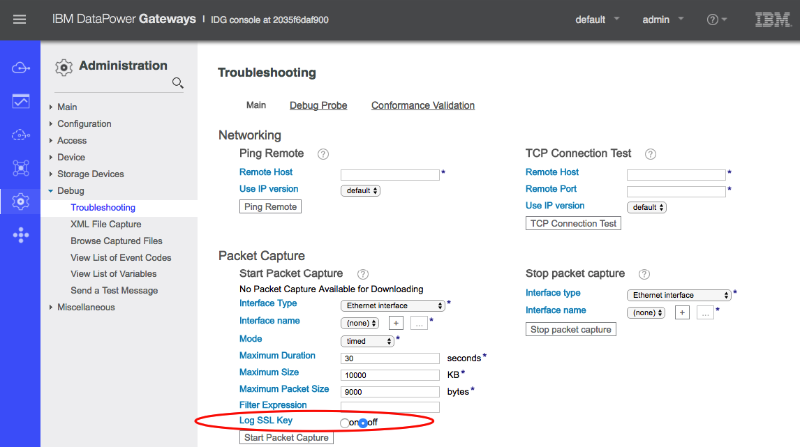

## Decrypt DataPower TLS/SSL traffic using master secret logging

Using TLS/SSL everywhere is more than a best practice, its a necessity. This can often make debugging network level problems more difficult and require the sharing of private key information.

With DataPower 7.5.2 we added a new feature to log the session master secret, which can be used in combination with Wireshark to decrypt the TLS/SSL traffic without having to copy the private key to the system running Wireshark.

System administrators have the option to enable this feature when starting a network packet capture:



Once the packet capture is started the system will begin logging the private master secret information to logtemp:///sslkeyfile.log

Stop the packet capture and copy logtemp:///sslkeyfile.log and temporary:///capture.pcap to a system running Wireshark:

Open Wireshark and from the menu select “Preferences -> Protocols -> SSL”. In the (Pre)-Master-Secret log filename input, specify the location of the sslkeyfile.log copied from DataPower:

If your using a non-standard port for HTTPS, update “Preferences -> Protocols -> HTTP” as shown below:

Now load the packet capture file using "File -> Open" to see that the TLS sessions containing a complete TLS handshake are now decrypted automatically.
