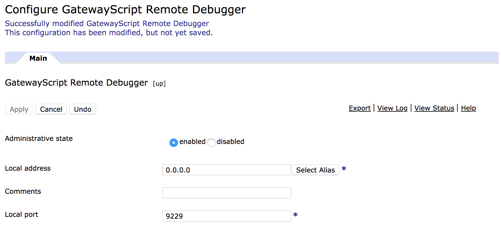
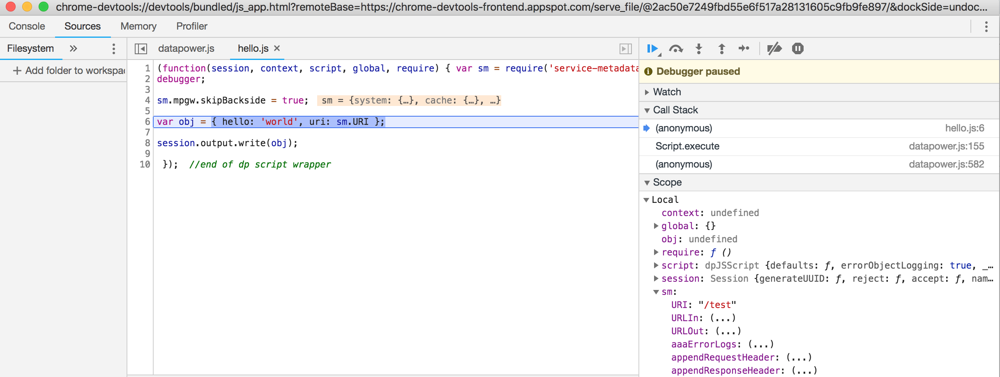

## GatewayScript remote debugging

Prior to DataPower version 2018-4-1, debugging your GatewayScript code could only be done by using DataPower's command line debugger, accessible via `debug <session-id>`.

The CLI debugger is very simple but provides a good way to get started with debugging. Unfortunately, it has numerous limitations:

* current frame inspection only, cannot switch to other frames
* no conditional breakpoints
* limited source code visibility
* no recent improvements and functionality

### Configuring remote debug support

To get started with the remote debugging support, it is necessary to configure the `GatewayScript Remote Debugger` object in the `default` domain. All that is required is to configure the network address and port where the remote debugger will listen for connections.  



**Note**: It is important to only enable the remote debugging on internal interfaces and not in production environments as it allows full access to the GatewayScript code being executed.

### Debugging

Once the remote debugger capability is enabled, you can use the debugger as you would normally do for the CLI debugger. See [https://www.ibm.com/support/knowledgecenter/en/SS9H2Y_7.7.0/com.ibm.dp.doc/debugger_action_js.html] for more information.

To debug your GatewayScript code, add a `debugger` statement somewhere in the code you want to debug and enable the `debug` flag for the action that runs the GatewayScript code. For example:

```
action hello-policy_rule_0_gatewayscript_0
debug
exit
```

Once debugging is turned on for the action, you can submit a client request that exercises the action. It will be paused waiting for a debugger to attach, either via CLI or remotely once it reaches the any `debugger` statements that were added. 

Using Chrome DevTools as example, open `chrome://inspect`, click on `Configure...` and add the DataPower IP address and port that were configured for the remote debugging capability. If there is an active session available for debugging, it will be listed in the Remote Target where you can click to open the full featured debugger interface, where you can place further breakpoints and inspect data content.



### Remote Debuggers supported

Any remote debugger that works with [Chrome DevTools Protocol](https://chromedevtools.github.io/devtools-protocol/) will work with the DataPower remote debugger capability. Examples of supported debuggers:

* [Chrome DevTools](https://github.com/ChromeDevTools/devtools-frontend)
* [Visual Studio Code](https://github.com/microsoft/vscode)
* [Visual Studio](https://github.com/Microsoft/nodejstools)
* [JetBrains WebStorm](https://www.jetbrains.com/webstorm/)

See [Inspector Clients](https://nodejs.org/en/docs/guides/debugging-getting-started/#inspector-clients) for specific debugger setup instructions.
