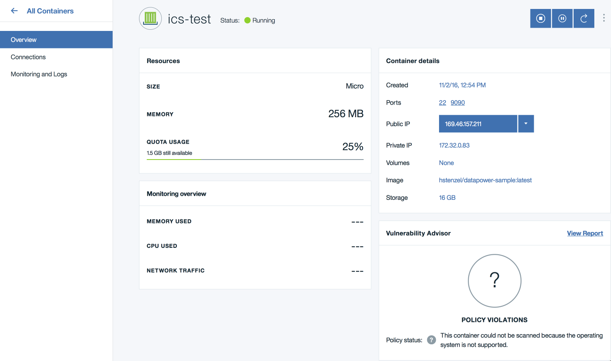

## Using DataPower for Docker in IBM Container Service

IBM DataPower Gateway for Docker can be deployed in all sorts of places, including in IBM Container Service (ICS). While DataPower isn't yet in the container services' catalog, you can still use use DataPower in the container service, and this guide will show you how.

If you're a developer wondering if this is a good place to start your DataPower Development, the answer is an emphatic *no*. If you're starting to wonder how you might deploy a composed DataPower application on IBM Container Service, then this is a great place to start.

## Preparation

Before you get started, please make sure you have an account on [IBM Bluemix](http://bluemix.net) and that you've installed the [IBM Containers plug-in](https://console.ng.bluemix.net/docs/containers/container_cli_cfic.html#container_cli_cfic).

Follow that doc and log in with the `cf login` command and the `cf ic login` command. In this guide, we'll use "Option 1", which is to use the `cf ic` commands to work with ICS. We won't change the `DOCKER` environment variables. This way, whenever you see `cf ic` commands you know we're referring to the IBM Container Service and when we use `docker` commands you know we're referring to your local Docker install.

The next step is to get DataPower for Docker. It is [available on Docker Hub](https://hub.docker.com/r/ibmcom/datapower/). You will need at least version 7.5.2.1 of DataPower in order to run in IBM Container Service. As of this writing, 7.5.2.1 is available as `ibmcom/datapower:beta` or `ibmcom/datapower:beta-7.5.2.1.281830`. So go ahead and `docker pull` an appropriate version of DataPower, such as:

```
$ docker pull ibmcom/datapower:beta
```

Note that if you want to run DataPower locally, you must ensure that the host your Docker Engine is running on has at least 4G of RAM. The default Docker install for Windows and OSX dos not have enough RAM.

While you're at it, you should try running DataPower locally and familiarize yourself with the license terms. [Getting Started](https://developer.ibm.com/datapower/docker/) with DataPower for Docker will show you how.

## Build Your Image

Since our only goal here is to demonstrate DataPower running in IBM Container Service, we don't need much DataPower configuration. All we want to do is to turn on `ssh` and `web-mgmt` inside the container so we can connect to it and look around after it comes up.

This is a bit unusual because normally we would *not* want to build a DataPower image with management interfaces enabled. This is a special case because the only thing we are intending to show is DataPower running in IBM Container Service.

In a new directory, we'll create two files. We will need `auto-startup.cfg`, which will hold the configuration DataPower will run when it starts; and we will create a `Dockerfile` that describes how our image is built. If you'd rather not create the files yourself, you can find this content on [GitHub in datapower-tutorials](https://github.com/ibm-datapower/datapower-tutorials) under `using-datapower-in-ibm-container-service`.

`auto-startup.cfg` simply enables `ssh` and `web-mgmt`:

```
top; co

ssh

web-mgmt
  admin enabled
  port 9090
exit
```

`Dockerfile` for this application is simple. We've been working with `ibmcom/datapower:beta` so we'll use that here as well. Again, it could be anything as long as it contains DataPower v7.5.2.1 or later. We'll assert license acceptance with `DATAPOWER_ACCEPT_LICENSE=true`; limit worker threads for our small deployment; and disable color logging. Next we `EXPOSE` ports for `ssh` and `web-mgmt` and copy our startup configuration into the image.

```
FROM ibmcom/datapower:beta

ENV  DATAPOWER_ACCEPT_LICENSE=true \
     DATAPOWER_WORKER_THREADS=2 \
     DATAPOWER_LOG_COLOR=false

EXPOSE 22 9090

COPY auto-startup.cfg /drouter/config/auto-startup.cfg
```

Now that you have an directory with only `auto-startup.cfg` and `Dockerfile`, it's time to make our image. Before you can do this, you'll have to know the IBM Container Service namespace that you used. If you don't know, you can discover it with `cf ic namespace get`. My namespace is `hstenzel`, so I'll use that for these examples. Notice that I am tagging my image with the ICS registry in my ICS namespace:

```
$ docker build -t registry.ng.bluemix.net/hstenzel/datapower-sample .
Sending build context to Docker daemon 8.192 kB
Step 1 : FROM ibmcom/datapower:beta
 ---> 72c12e7a877d
Step 2 : ENV DATAPOWER_ACCEPT_LICENSE true DATAPOWER_WORKER_THREADS 2 DATAPOWER_LOG_COLOR false
 ---> Running in 5775c087fe3f
 ---> 39ff5bcc1eaa
Removing intermediate container 5775c087fe3f
Step 3 : EXPOSE 22 9090
 ---> Running in de9a8e8d6559
 ---> 6d615a82d184
Removing intermediate container de9a8e8d6559
Step 4 : COPY auto-startup.cfg /drouter/config/auto-startup.cfg
 ---> af98701b435f
Removing intermediate container 3be4b296080c
Successfully built af98701b435f
```

This is a great time to try out your newly built image. It's far better to find out that it's not working correctly now than after you push to Bluemix.

```
$ docker run -d -p 2200:22 -p 9090:9090 --name unit-test registry.ng.bluemix.net/hstenzel/datapower-sample
```

Once that has started, you can ssh into DataPower on port `2200` and log in with user `admin` and password `admin`. All we want to do is log in via ssh, so after we log in we'll `exit` immediately.

```
$ ssh -p 2200 127.0.0.1
Warning: Permanently added '[127.0.0.1]:2200' (RSA) to the list of known hosts.
6ae49f1a03b6
Unauthorized access prohibited.
login: admin
Password: *****

Welcome to IBM DataPower Gateway console configuration.
Copyright IBM Corporation 1999-2016

Version: IDG.7.5.2.1beta1 build 281830beta1 on Oct 12, 2016 11:35:00 AM
Serial number: 0000001

idg# exit
Connection to 127.0.0.1 closed by remote host.
Connection to 127.0.0.1 closed.
```

Then clean up our `unit-test` container with `docker rm -f unit-test`.

Congratulations, you have built a Docker image with DataPower that will allow you to log in and prove that the gateway is running! Next it's time to move it into IBM Container Service!

## Running Your Image in IBM Container Service

At this point you have a local image that you have unit tested. Now you want to run it in IBM Container Service. There are three steps to this process:

1. Put the image in ICS
1. Run the image
1. Establish connectivity to the running container

Let's take those steps in turn.

Pushing the image to ICS is a single command. We push the same image that we built in the previous section, so be sure to replace `hstenzel` with your namespace. The first time you do this it will take quite a while since it will have to transfer all of DataPower. If you build further images `FROM` the same DataPower base image, subsequent pushes will not have to transfer as much data and will be quite quick.

We're using the `docker push` command because the ICS registry is just a normal registry as far as Docker is concerned.

```
$ docker push registry.ng.bluemix.net/hstenzel/datapower-sample
The push refers to a repository [registry.ng.bluemix.net/hstenzel/datapower-sample]
eac50023b261: Pushed
f3c90213ec2c: Layer already exists
551d9a9ae574: Layer already exists
latest: digest: sha256:8751aad779146cb0cd7190b53bb1fb2210c2e36d663b45ec03184734ba14884c size: 5057
```

Next we run the image. We map all ports with `-P` and name the container `ics-test`.

```
$ cf ic run -P --name ics-test registry.ng.bluemix.net/hstenzel/datapower-sample
64c98828-0e7c-464b-80c5-79deee81b05d
```

We can check that it is running with the `cf ic ps` command:

```
$ cf ic ps
CONTAINER ID        IMAGE                                                      COMMAND             CREATED             STATUS                    PORTS               NAMES
64c98828-0e7        registry.ng.bluemix.net/hstenzel/datapower-sample:latest   ""                  21 seconds ago      Building 19 seconds ago   22/tcp, 9090/tcp    ics-test
```

Once `cf ic ps` shows `Running`, DataPower is up. We can see that with `cf ic logs unit-test` -- there will be lines indicating that both `ssh` and `web-mgmt` are up. But we still cannot access DataPower because there is no public IP address associated with the container.

Let us assume that you don't have any ICS IP addresses yet -- if you're just getting started, this is probably the case, but you can check with the `cf ic ip` command.

The task before us is to request a new IP address and use that address with our `ics-test` running container. This is done in two steps, first by requesting the IP address with the `cf ic ip request` command and secondly by binding the address to the container with the `cf ic ip bind` command.

First the request:

```
$ cf ic ip request
OK
The IP address "169.46.157.211" was obtained.
```

Then the bind. Notice that we use the bind address from the previous step and the name of the container we created with `cf ic run`:

```
$ cf ic ip bind 169.46.157.211 ics-test
OK
The IP address was bound successfully.
```

You can see that it has worked when `cf ic ps` shows `Running` with the ports mapped and when `cf ic ports ics-test` shows the mapped ports.

Let's log in to DataPower running in IBM Container Service by using ssh to connect to the IP address that we bound to the `ics-test` container:

```
$ ssh 169.46.157.211
Warning: Permanently added '169.46.157.211' (RSA) to the list of known hosts.
instance-005cd5c7
Unauthorized access prohibited.
login: admin
Password: *****

Welcome to IBM DataPower Gateway console configuration.
Copyright IBM Corporation 1999-2016

Version: IDG.7.5.2.1beta1 build 281830beta1 on Oct 12, 2016 11:35:00 AM
Serial number: 0000001

idg#
```

## Check the Bluemix Console

Finally, remember that you can see everything from the Bluemix Console as well:



Notice a few things in the Bluemix console:

In `Resources`, see that DataPower is able to come up in just 256 MB, using the `Micro` size. We could have specified a different size on the `cf ic run` command line, but we didn't need to for this demonstration.

Everything in the `Container details` section aligns with what we requested with the combination of `Dockerfile` and `cf ic` commands.

The `Vulnerability Advisor` does not yet know about DataPower, so it's not able to say much. The image does not contain a standard Linux distribution so scanning is not possible.

## Cleaning Up

Remember that IBM Container Service charges by usage, so we'll want to stop the container if we're not using it. If you want to poke around a bit more, remember that we enabled `web-mgmt`, so you could connect to `https://169.46.157.211:9090` (but be sure to use *your* IP address!).

```
$ cf ic rm -f ics-test
```

## Closing

I hope this guided tour of DataPower in IBM Container Service gives you a little taste of what is possible. There are many places to go from here -- some examples include:

- Making your DataPower composed application
- Using Docker Compose with your application
- Using Docker Compose with IBM Container Service to deploy your application

The possibilities are endless. All the best practices around Dockerizing composed applications apply equally when that application is DataPower.

Thank you for for your time, and please let us know what you think!
