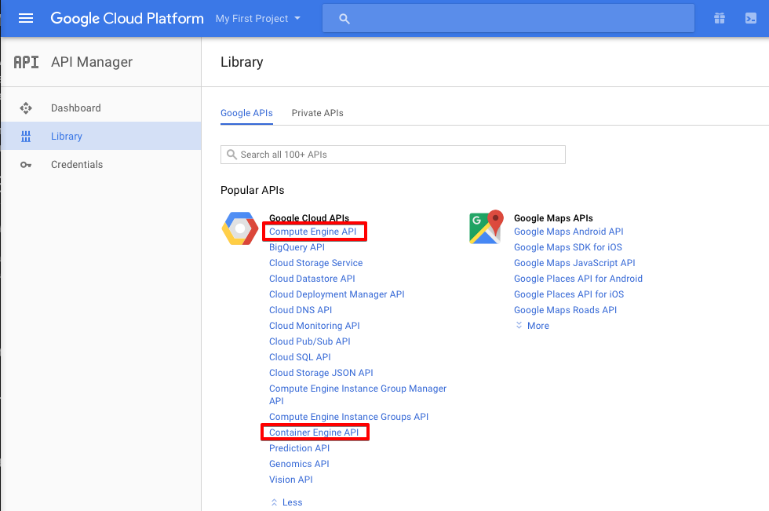
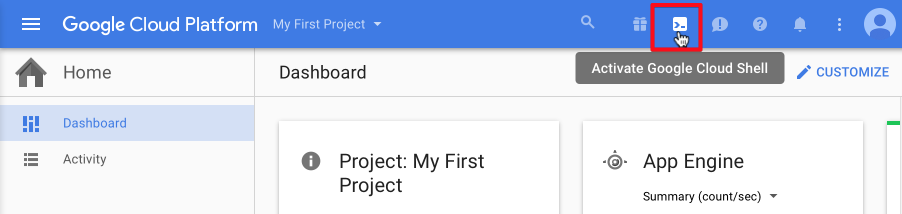
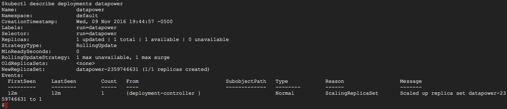
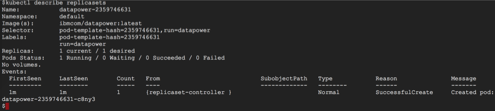
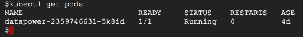

## Getting Started with DataPower and Google Container Engine (GKE)
This tutorial provides a walkthrough on the basics of getting up and running with DataPower in Kubernetes, 
a robust, production-ready orchestrator for Docker containers.

By building up from the core concepts of how applications are deployed and manged in Kubernetes we hope to
build the foundation for more advanced topics such as application configuration, service discovery, scaling,
update rollouts, and monitoring.

This tutorial uses the Google Container Engine to provide a hosted Kubernetes environment. Naturally,
you can use any Kubernetes environment of your choosing. As such, we will mark the sections pertaining to
GKE with an "(Optional)" designation.

## Tools we will use
* Docker
    * We use Docker to package, distribute and run 
    * https://www.docker.com

* IBM DataPower Geteway for Docker
    * Available as a Docker image in DockerHub
    * https://hub.docker.com/r/ibmcom/datapower/
    * https://developer.ibm.com/datapower/

* Kubernetes
    * Handle the heavy lifting of orchestrating our application
    * http://kubernetes.io

* Google Container Engine (GKE) (Optional)
    * A hosted Kubernetes service
    * https://cloud.google.com/container-engine

* Google Cloud Shell (Optional)
    * A shell environment for managing Google Cloud Platform resources
    * https://cloud.google.com/shell/docs/
    
## Setting up our Environment

### Create  Google Cloud Platform (GCP) account (Optional)
In order to best follow along with this tutorial, you will want access to a Google Cloud Platform account.
You can use an existing account or sign up for a free trial 
[here](https://console.cloud.google.com/freetrial "Create a Google Cloud Platform account").

### Create a GCP Project (Optional)
You may use the default project, an existing project, or create a new one as described
 [here](https://support.google.com/cloud/answer/6251787 "Create a GCP project").

### Enable Cloud resources and Cloud Shell (Optional)
You will need to enable the following in the [Google API Console](https://console.developers.google.com/)
* __Compute Engine API__
* __Container Engine API__

And familiarize yourself with the Google Cloud Shell which we will use to manage our
Google Cloud Platform resources. You can find a getting started for the Google Cloud Shell 
[here](https://cloud.google.com/shell/docs/quickstart "Google Cloud Shell Getting Started").
Once ready, head over to your project page in the Google Cloud Platform web console and
start a Google Cloud Shell session.



To avoid having to specify the --zone flag when required, you can set the region with:
    
```
$ gcloud config set compute/zone <zone>
```
To see valid choices for `<zone>`, run:
```
$ gcloud compute zones list
```

### Setting Up a Kubernetes cluster with GKE (Optional)

GKE provides a hosted Kubernetes service that can be customized. We will leverage Kubernetes to handle the complexity 
associated with orchestrating application containers.

To provision a GKE cluster, open up your project in Google Cloud Platform and start an instance of the Google Cloud Shell.
Next, run the following command to create a GKE cluster of 3 nodes for use in this tutorial:

```
$ gcloud container clusters create k8s-cluster

kubeconfig entry generated for k8s-cluster.
NAME          ZONE        MASTER_VERSION  MASTER_IP       MACHINE_TYPE   NODE_VERSION  NUM_NODES  STATUS
k8s-cluster  us-east1-b  1.4.7           104.196.69.190  n1-standard-1  1.4.7         3          RUNNING
```

This might take a couple of minutes.

With our cluster up and running, we are now ready to run containers. 

### Get the Source Code

```
$ git clone https://github.com/ibm-datapower/datapower-tutorials.git
$ cd datapower-tutorials/using-datapower-in-kubernetes/
```


##  Introduction to Kubernetes


###  Pods

In Kubernetes, all containers run in what's called a pod. A pod represents a logical application composed of co-located 
and co-scheduled containers, shared storage, and certain shared namespaces. Pods, not containers, are the smallest deployable artifact in Kubernetes.

To run a pod directly, we can, for example, run a DataPower container with:

```
$ kubectl run --stdin --tty datapower --image=ibmcom/datapower:latest --env="DATAPOWER_ACCEPT_LICENSE=true" --env="DATAPOWER_INTERACTIVE=true"

```

This will automatically create a default Kubernetes _deployment_ , which is a Kubernetes construct that lets you declare the desired state of
your application and is used to update your pods or replica sets to try to match the current state of your application to that of the desired state.
You can specify deployments, pods, services, replica sets, etc. declaratively in Kubernetes by writing a
corresponding configuration file.

In a separate Google Cloud Shell session, we can run `$ kubectl describe deployments` to show the details
 of the *datapower* deployment we just created.
 
 

Don't worry if not everything from the output makes sense at this point, the main idea here is that we can use the `describe` command to 
show the details of various Kubernetes objects as we will soon see. Additionally, note the section titled "NewReplicaSet" which lists the replica set used by our deployment.
We can see the details of our replica sets by using the `$ kubectl describe replicasets`.



As we can see in the section "Replicas", this replica set describes our current state of "1 current" running pod
and our desired state of "1 desired" running pod.

Similarly, we can run the `$ kubectl get pods` command to view the running datapower pod. 



To demonstrate the role of replica sets, lets manually delete the datapower pod.
To do this, we run: 

```
$ kubectl delete pods <pod_name>
```

where <pod_name> is the name of the pod as listed in `$kubectl get pods`.

We expect the replica set to note that change of state, our datapower pod being deleted, and promptly start a new pod for us running our datapower image.
To ensure this, we check `$ kubectl get pods` again which shows a new pod (note the new name) running our datapower image.
We can can also see this change in the event output of our replica set.

```
$ kubectl describe replicasets
```

Lastly, our first Google Cloud Session will also show our previous interactive session with the container has now
been terminated since we issued a deletion of the pod. To reattach to the new container created by the replica set,
we can issue:

```
$ kubectl attach <pod_name> --container="datapower" --stdin --tty
```

And log in to datapower using the default user "admin" and "admin" password.

Once you are done you can delete the deployment as we will not make further use of it in this tutorial.

We delete the deployment by issuing:
`$ kubectl delete deployment <deployment_name>`

## Deploying  a Composed Application in Kubernetes

Now that we've gotten a small taste of Kubernetes, we can begin to deploy a simple composed applicaiton.
For this tutorial, we will use a similar application to the one in the [Docker Compose sample](https://developer.ibm.com/datapower/2016/11/11/a-datapower-with-docker-compose-hello-world-application/).
The applications consists of an nginx 'backend' that just responds with a simple "Hello from \<hostname>" message and a DataPower service 
on the front that proxies the request and transforms the response from the backend, using Gatewayscript, by prepending
"DataPower proxied: \<response>". 
In order to achieve this in Kubernetes, we will:
* Provide the DataPower application configuration as a Kubernetes *ConfigMap*
* Deploy our application in Kubernetes
* Expose the Kubernetes *Service* so that our *datapower*  can communicate to our *backend* without knowing all the details of the backend application


### Configuring our Application Using ConfigMaps

One best practice is to separate your application code from your configuration. To this end,
Kubernetes provides a `ConfigMap` resource as of version 1.2.
A ConfigMap is a flexible object for providing your application with non-secret configuration data. The data
is presented as key-value pairs and can represent cli arguments, environment variables, and files in a mounted volume.

Let's create a ConfigMap from our `datapower/config` and `datapower/local` directories which look as follows:

```
$ tree datapower
datapower
├── config
│   ├── auto-startup.cfg
│   ├── auto-user.cfg
│   └── foo
│       └── foo.cfg
└── local
    └── foo
        └── hello.js

4 directories, 4 files
```

These will set up our DataPower domain with application logic and services; it will also place applicaiton data, such as our gatewayscript file, in the right directory.

To create the ConfigMaps, simply `cd` to the `datapower` directory and type:

`$ kubectl create configmap datapower-config --from-file=config/ --from-file=config/foo`

`$ kubectl create configmap datapower-local-foo --from-file=local/foo`

And to get more details about the ConfigMaps we just created, we can type:

`$ kubectl describe configmap `

We are now ready to consume the `datapower-config` and `datapower-local-foo` ConfigMaps in a Kubernetes deployment.


### Deploying Applications

For pretty much any non-trivial application deployment, we want to have a more reproducible way to define,
compose and deploy our application than issuing manual commands. Therefore, a best practice is to define
our application using *Deployments*. As mentioned earlier, a *deployment* will, amongst other things, ensure that the specified
number of pod "replicas" are running at any given time. Below is the sample *deployment* YAML for the *datapower* application
 we use for this tutorial:

```
apiVersion: extensions/v1beta1
kind: Deployment
metadata:
  name: datapower
spec:
  replicas: 1
  template:
    metadata:
      labels:
        app: datapower
        track: stable
    spec:
      containers:
      - name: datapower
        image: "ibmcom/datapower:latest"
        stdin: true
        tty: true
        ports:
        - name: web-mgmt
          containerPort: 9090
        env:
        - name: DATAPOWER_ACCEPT_LICENSE
          value: "true"
        - name: DATAPOWER_INTERACTIVE
          value: "true"
        volumeMounts:
        - mountPath: /drouter/config/foo/foo.cfg
          name: config-volume
          subPath: foo.cfg
        - mountPath: /drouter/config/auto-startup.cfg
          name: config-volume
          subPath: auto-startup.cfg
        - mountPath: /drouter/config/auto-user.cfg
          name: config-volume
          subPath: auto-user.cfg
        - mountPath: /drouter/local/foo
          name: local-foo-volume
      volumes:
      - name: config-volume
        configMap:
          name: datapower-config
      - name: local-foo-volume
        configMap:
          name: datapower-local-foo
```

Note that we use the `datapower-config` and `datapower-local-foo` ConfigMaps as a `volumes` parameter and mount it in the `volumeMounts` section.
The `mountPath: /drouter/config` is special in this case because DataPower will automatically execute a config file named
*auto-startup.cfg* if found in the */drouter/config* directory, which we have placed in this configMap. 

There is likewise a *deployment* file for our *backend* application which can be found under `kubernetes/deployments/backend-deployment.yaml`

To create the deployments we head over to the `kubernetes/deployments` directory and issue the following commands:

`$ kubectl create -f datapower-deplyment.yaml`

`$ kubectl create -f backend-deployment.yaml`

### Exposing Our Application to the Internet

Before we continue, let's stop and reflect for a minute on what we have accomplished so far. At this time, we have deployed an applicaiton
 that can recover from a failure in one of our nodes in our Kubernetes cluster. We can deploy this applicaiton in a highly reproducible way.
 Additionally, the application's configuration is managed independently of the application and can be changed easily without having to rebuild our applicaiton.

Now, we want to expose the application service so that we can access it from the public internet. 
We can expose the datapower multi-protocol gateway service running on port 80 that was configured using our  `datapower-config` ConfigMap by 
heading over to the `kubernetes/services` directory and running:

`$ kubectl create -f datapower-service.yaml`

This will create a Kubernetes *Service* that we can use to get the external IP and port we just exposed. To view it, run:

`$ kubectl get service datapower`

```
$ kubectl get service datapower
NAME        CLUSTER-IP    EXTERNAL-IP       PORT(S)           AGE
datapower   10.7.246.47   104.196.131.123   80/TCP            12h
```

Which might take a minute or two to populate the external IP.
If you are following along with GKE as in this tutorial,  you will also need make sure that traffic from 
external IPs is allowed by opening a firewall traffic rule on port 80 as follows:

`$ gcloud compute firewall-rules create datapower-mpgw --allow=tcp:80`

We should now be able to send a request to our service from the public internet.

```
$ curl -k 104.196.131.123:80
DataPower Proxied: Hello world from backend-113429680-tmq5q
```

Success!

## Cleaning it Up

In order to prevent incurring charges in Google Cloud Platform when not using our cluster we will
want to delete the Kubernetes cluster we created earlier. In a Google Cloud Shell session, type:

```
$ gcloud container clusters delete k8s-cluster
```

## Conclusion

We hope this introduction to running DataPower in Kubernetes was helpful in building a foundation 
that you can use when proceeding to build more complex applications that follow industry best-practices.

From here, we are ready to explore more advanced topics. Some example next steps include:
* Services provisioning and discovery
* Scaling microservices in your application
* Managing secrets in Kubernetes
* Update rollouts
* Application health checks and monitoring

Thank you and please let us know what you think by commenting or submitting your own pull request 
in our [GitHub repo](https://github.com/ibm-datapower/datapower-tutorials)